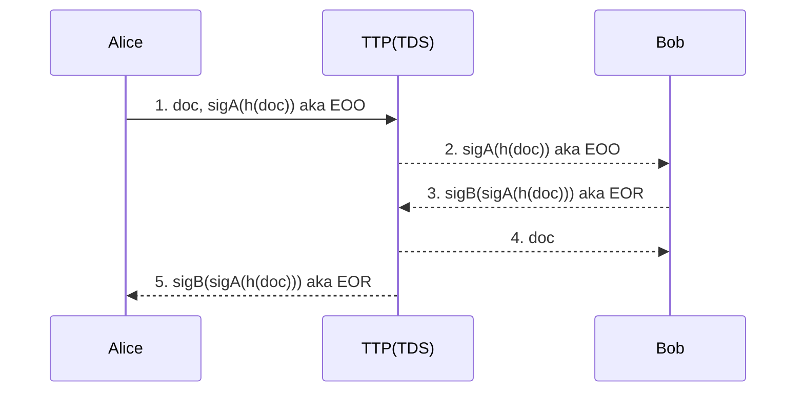

# Design Decision for Group Project CSC8109
## High Level Overall Architecture:
- S3 as the file storage component, including Document(Contract), EOO, EOR and Private key, Public key.
- Serverless architecture utilising Lambda functions
- TTP – encompassing S3 and Lambda logic to control the flow of messages. Usage of DynamoDB to keep track of state of message

## Encryption

- Do encryption is the Lambda Function.
- To start off, hold keys in DynamoDB associated. If time permits, use AWS Key Management.

## Users
- Use **Sub**  as universal unique identity in the system.
- API level Authentication with JWT provided by Cognito service
- Personalized Page for each user (Show’s messages that they have received)

## File Storage Service with S3
S3 is used to provide 2 services:
- 1. Encrypted file storage system
    - Every user will have a individual folder with the name of user Sub, and all transactions will have its own sub folder named with the transaction id.
    - All common lambda functions only have the access to the folder that belong to the user passed from jwt, and file transferation can only be conducted by TTP functions through SQS system.
- 2. Static website hosting for html pages

## Lambda Architecture:

- Single use stateless functions
- Accessed via RESTful service
- RESTful service provided by API Gateway
- Use Cognito to manage user pool and use JWT proviced by Cognito to authorize every request through the lambda function

## Individual Lambda Functions

-	add a document to the store (corresponding to step 1 of the protocol)
-	request an identified document (corresponding to step 2 of the protocol - note the signature over the document is returned not the document)
-	get a document (corresponding to steps 3 and 4 of the protocol - the requester provides a receipt and obtains the document in return)
-	get a receipt associated with a document (corresponding to step 5 of the protocol)

## DynamoDB
- we use DynamoDB to store all the user information and store all transactions in this system.
### FesUser Table
- email - Primary Key, String
- ~~sub - String, the uuid provided by *Cognito* to identify a single user~~
- fullName - String
- ~~?publicKey – String~~
- ~~?privateKey – String~~
- ~~inboundTransactions - String - List of Inbound Transaction uuids related to this user~~
- ~~outboundTransactions - String - List of Outbound Transaction uuids related to this user~~

## FesTransactions - (To keep track of the state of the message)
- transactionId - Primary Key, String
- sender - String
- reciever - String
- transactionState – OnGoing / Aborted / Resolved
- ~~state – Integer~~
- ~~eoo - String~~
- ~~eor - String~~
- documentUri - String
- createTime - Datetime
- updateTime - Datetime
- remark - String
*Possibly use a mixture of JSON and Dynamo To keep track of state and accessing fair exchange variables*

## Cognito - (to maintain all user login and register information)
All our user login and register function will be implemented by AWS Cognito, and the user sub, email, full name will be maintained in user table in DynamoDB.
Functions that provided by Cognito:
- User Login
- User Registeration
- User Email Verify

## UML diagrams

