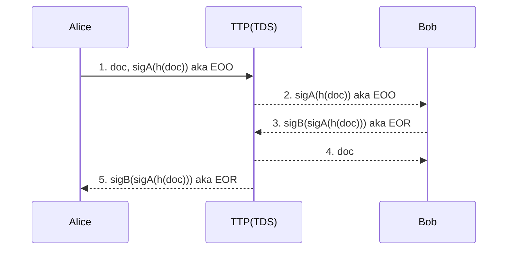

# Design Decision for Group Project CSC8109
## High Level Overall Architecture:
- Serverless architecture utilising Lambda functions
- TTP – encompassing S3 and Lambda logic to control the flow of messages. Usage of DynamoDB to keep track of state of message

## Encryption

- Do encryption is the Lambda Function.
- To start off, hold keys in DynamoDB associated. If time permits, use AWS Key Management.

## Users

- Basic Authentication
- Personalized Page for each user (Show’s messages that they have received)

## Lambda Architecture:

- Single use stateless functions
- Accessed via RESTful service
- RESTful service provided by API Gateway
- Use Cognito to manage user pool and use JWT proviced by Cognito to authorize every request through the lambda function

## Individual Lambda Functions

-	add a document to the store (corresponding to step 1 of the protocol)
-	request an identified document (corresponding to step 2 of the protocol - note the signature over the document is returned not the document)
-	get a document (corresponding to steps 3 and 4 of the protocol - the requester provides a receipt and obtains the document in return)
-	get a receipt associated with a document (corresponding to step 5 of the protocol)

## DynamoDB
- we use DynamoDB to store all the user information and store all transactions in this system.
### Users Table
- email - Primary Key, String
- sub - String, the uuid provided by Cognito to identify a single user
- fullName - String
- ?publicKey – String
- ?privateKey – String
- inboundTransactions - String - List of Inbound Transaction uuids related to this user
- outboundTransactions - String - List of Outbound Transaction uuids related to this user

## Transactions - (To keep track of the state of the message)
- transactionId - Primary Key, String
- sender - String
- reciever - String
- status – OnGoing / Aborted / Resolved
- ~~state – Integer~~
- ~~eoo - String~~
- ~~eor - String~~
- documentUri - String
- createTime - Datetime
- updateTime - Datetime
- remark - String
*Possibly use a mixture of JSON and Dynamo To keep track of state and accessing fair exchange variables*

## UML diagrams

